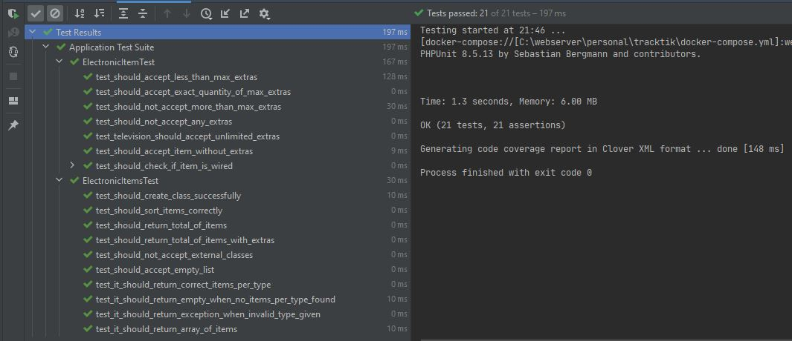
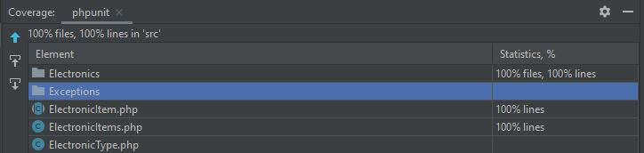

# Tracktik

## Question 1: 
Using the code given, create each type of electronic as classes.  
Every ElectronicItem must have a function called maxExtras that limits the number of extras an electronic item can have. The extras are a list of electronic items that are attached to another electronic item to complement it.  

- The console can have a maximum of 4 extras
- The television has no maximum extras
- The microwave can't have any extras
- The controller can't have any extras

### Create a scenario where a person would buy:

- 1 console
- 2 televisions with different prices 
- 1 microwave

The console and televisions have extras; those extras are controllers.  
The console has 2 remote controllers and 2 wired controllers.    
The TV #1 has 2 remote controllers, and the TV #2 has 1 remote controller.

Sort the items by price and output the total pricing.

## Question 2: 
That person's friend saw her with her new purchase and asked her how much the console and its controllers had cost her. 
Give the answer.
Please return the test in a compressed PHP file or through an online Git repository (GitHub or similar).

You will be evaluated by several TrackTik developers on the following aspects: (scale of 1 to 10)
- Correct Output of Code and Bug Free
- Code Clarity and Simplicity
- Code Structure
- Application of Object-Oriented Concepts
- Technical Level of Solution vs your level of expertise

# Output of index.php
My basket

- Item: console, price: US$ 300, total: US$ 360
    - Extra: controller wired, price: US$ 20
    - Extra: controller wired, price: US$ 20
    - Extra: controller 1, price: US$ 10
    - Extra: controller 1, price: US$ 10
- Item: television, price: US$ 100, total: US$ 140
    - Extra: controller wired, price: US$ 20
    - Extra: controller wired, price: US$ 20
- Item: television, price: US$ 200, total: US$ 220
    - Extra: controller wired, price: US$ 20

Sorted Items

- Item: television, price: US$ 100, total: US$ 140
    - Extra: controller , price: US$ 20
    - Extra: controller , price: US$ 20
- Item: television, price: US$ 200, total: US$ 220
    - Extra: controller , price: US$ 20
- Item: console, price: US$ 300, total: US$ 360
    - Extra: controller , price: US$ 20
    - Extra: controller , price: US$ 20
    - Extra: controller wired, price: US$ 10
    - Extra: controller wired, price: US$ 10

Total for item console: price: 300 total with extras: 360

# Extras
## Test cases

## Code Coverage
